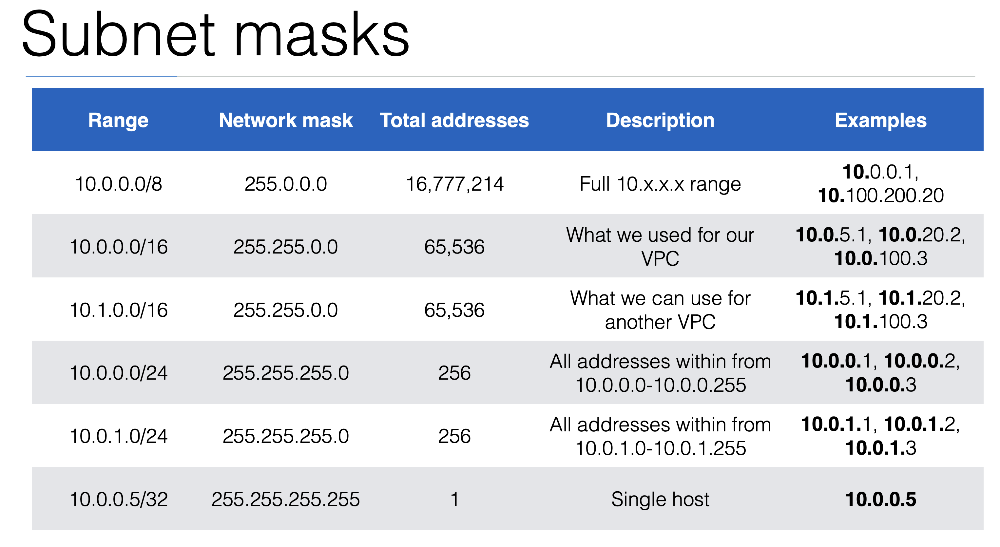
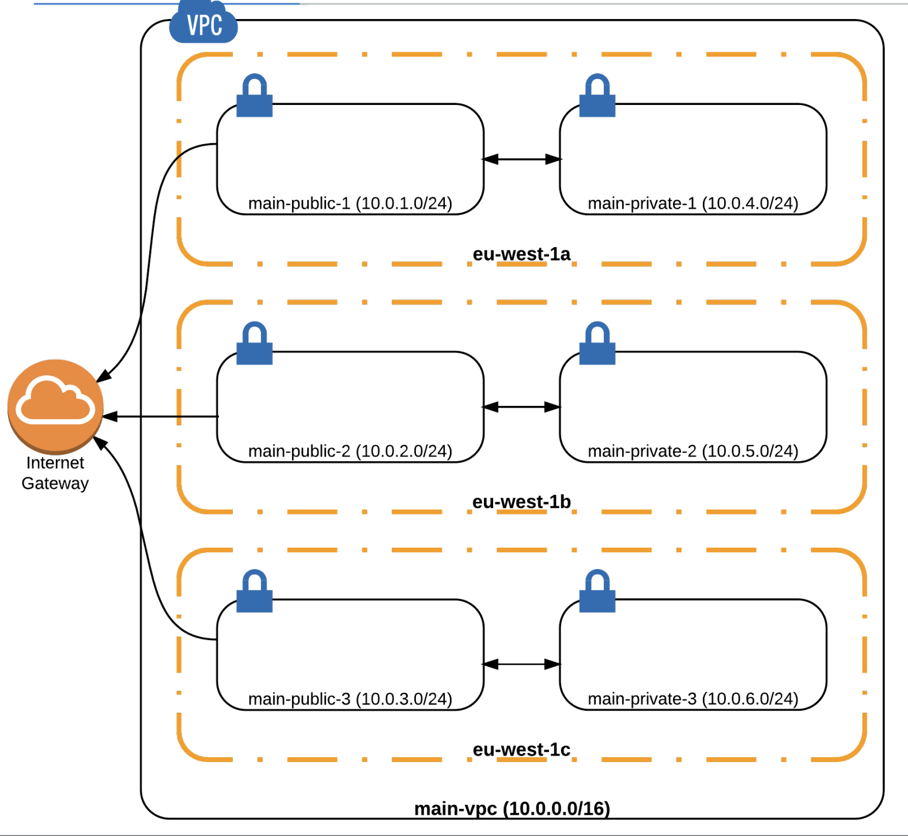

# AWS_VPC

VPC: 가상사설망

- 네트워크 레벨 상의 인스턴스들을 격리 : 클라우드의 개인 네트워크라고 생각해도됨

**_중소 규모 설정_**:
지역당 하나씩 VPC 수요가 적합

- 두 개의 서로 다른 VPC에서 두 개의 인스턴스를 시작한 경우 두 인스턴스는 서로 소통할 수 없음

  > **_해결방법_**

  1. 공용 IP를 통해서만 소통이 가능함.

     - 이는 보안적인 이슈가 있을 수 있음

     

  2. 서로 다른 VPC를 연결

  - 이는 peering이라고 부름 (VPC_peering)

## Private Subnet

<table>
    <tr>
        <th>
        Range
        </th>  
        <th>
        from
        </th>
        <th>
        to
        </th>
    </tr>
    <tr>
        <td>
        10.0.0.0/8
        </td>  
        <td>
        10.0.0.0
        </td>
        <td>
        10.255.255.255
        </td>
    </tr>
    <tr>
        <td>
        172.16.0.0/12
        </td>  
        <td>
        172.16.0.0
        </td>
        <td>
        172.31.255.255
        </td>
    </tr>
    <tr>
        <td>
        192.168.0.0/16
        </td>  
        <td>
        192.168.0.0
        </td>
        <td>
        192.168.255.255
        </td>
    </tr>
</table>

### Subnet masks

10.0.0.0/8

    - 255.0.0.0

10.0.0.0/16

    - 255.255.0.0

> 보통 10.0.0.0/16 사용하는 것을 추천

     
    10으로 시작하는 Subnet을 많이 가질 수 있다는 장점이있음
        -> 관리가 비교적 쉬워짐

예시 :

10.0.0.0/16

10.1.0.0/16

