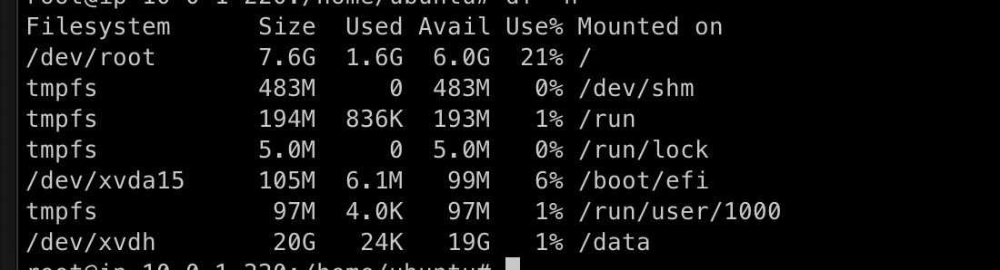

# EBS

EC2는 종료가 되면 저장하고있던 데이터가 사라짐.

자동으로 8GB의 EBS를 할당해주는 AMI도 있음.

로컬 저장소가 있는 AMI도 있음

이때 로컬 저장소를 임시저장소라 부름

### EBS resource

```terraform
resource "aws_ebs_volume" "ebs-volume-1" {
    availability_zon = "ap-northeast-2a"
    size = 20
    type = "gp2"
    tags = {
        Name = "extra volume data"
    }
}

#EBS 할당
resource "aws_volume_attacthment" "ebs_volume-1-attachment" {
    device_name = "/dev/xvdh"
    volume_id = aws_ebs_volume.ebs-volume-1.id
    intsance_id = aws_instance.ex_instance.id
}


#이러한 형식으로도 가능
resource "aws_instance" "example" {

  #...

  root_block_device {
    volume_type           = "gp2"
    volume_size           = 20
    delete_on_termination = true
  }
}


```

## Apply이후

디스크를 마운트해줘야함

```sh
df -h
#"df -h" 명령은 리눅스와 맥OS에서 파일 시스템의 디스크 사용 현황을 텍스트로 출력하는 명령어입니다. 이 명령을 사용하면 현재 시스템의 디스크 파티션 및 디스크 사용량, 여유 공간 등을 확인할 수 있습니다.

sudo -s
mkfs.ext4 /dev/xvdh

mkdir /data
mount /dev/xvdh /data

vim /etc/fstab
####
...
#추가
/dev/xvdh /data ext4 defaults 0 0
####


unmount /data
mount /data

## fstab 에 접근 가능해짐으로써, 인스턴스 재부팅해도 마운트 안해줘도됨
#
# 그러나 함정이 있음 terraform으로 인스턴스를 종료하고 테라폼을 사용해서 인스턴스를 다시 시작하면 변경된 내용이 사라짐.

#/etc/fstab은 /etc에 기반하고 /가 사라지기 때문
#이 문제는 userdata를 이용해서 해결가능 다음 sub 챕터에서 다루겠음.
```



## 사용 lunux명령어 정리

### sdh ? xbdh ?

"sdh"와 "xvdh"는 리눅스에서 디스크 장치 이름을 나타내는 두 가지 서로 다른 표기 방식입니다.

"sdh":
"sdh"는 기본 디스크 장치 이름 방식으로, 예전부터 사용되어 왔습니다. 이 방식은 하드 디스크를 "sd"로 시작하고, 그 뒤에 알파벳으로 디스크 번호를 붙이는 방식입니다. 예를 들어, 두 번째 디스크는 "/dev/sdb", 세 번째 디스크는 "/dev/sdc"와 같이 표시됩니다. 이 방식은 오래 전부터 사용되었지만, 현대적인 리눅스 시스템에서는 "sd" 디바이스 명명 방식보다 더 나은 방식을 사용하고 있습니다.

"xvdh":
"xvdh"는 Amazon EC2 인스턴스와 같은 가상화 환경에서 사용되는 새로운 디스크 명명 방식입니다. 이 방식은 Amazon Web Services (AWS)에서 사용하는 Xen 가상화 기술과 관련이 있습니다. 가상화 환경에서 디스크를 "xvd"로 시작하고, 그 뒤에 알파벳으로 디스크 번호를 붙이는 방식입니다. 예를 들어, 두 번째 가상 디스크는 "/dev/xvdb", 세 번째 가상 디스크는 "/dev/xvdc"와 같이 표시됩니다.

AWS EC2 인스턴스에서는 기본적으로 "xvdh" 형식을 사용하며, 이전 "sdh" 방식은 일부 호환성 문제로 인해 현대적인 AWS 인스턴스에서는 더 이상 사용되지 않습니다.

요약하면, "sdh"는 예전에 사용되던 기본 디스크 명명 방식이고, "xvdh"는 AWS EC2 인스턴스와 같은 가상화 환경에서 사용되는 새로운 디스크 명명 방식입니다. 대부분의 경우, 최신 리눅스 시스템에서는 "xvdh" 방식을 사용하는 것이 권장됩니다.

```sh
df -h
#"df -h" 명령은 리눅스와 맥OS에서 파일 시스템의 디스크 사용 현황을 텍스트로 출력하는 명령어입니다. 이 명령을 사용하면 현재 시스템의 디스크 파티션 및 디스크 사용량, 여유 공간 등을 확인할 수 있습니다.


mkfs.ext4
#"mkfs.ext4"는 리눅스에서 파일 시스템을 생성하는 명령어입니다. 이 명령은 디스크 또는 파티션에 ext4 파일 시스템을 생성하여 데이터를 저장할 수 있도록 준비하는 역할을 합니다.

mount
#"mount"는 리눅스와 맥OS에서 파일 시스템을 마운트하는 명령어입니다. 파일 시스템을 마운트하면 해당 파일 시스템을 사용하여 데이터에 접근할 수 있습니다.

```

### vim /etc/fstab

```
man fstab
```
