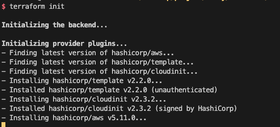
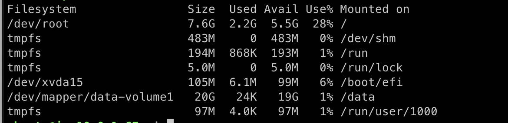

# Userdata

AWS의 userdata는 시작 할때 사용자 지정을 수행함

즉, 인스턴스를 실행할 때 사용자 데이터가 실행된다는 뜻.

> **_주의_**<br>
> 인스턴스의 재부팅 또는 재시작이 아니라, 새로만든경우 (launch)에만 가능함.

### 기능

1. 추가 소프트웨어를 설치할 수 있음.

2. 인스턴스를 준비해서 클러스트를 결합 수 있음
   - ECS....

<br>

3. 명령어나 스크립트를 실행할 수 있음
   - EBS volume을 마운트 할수도 있음

<br>

테라폼은 간단한 명령어를 위한 문자열로 aws_instance 리소스에 userdata를 추가하거나 템플릿을 사용할 수 있음

템플릿은 복잡한 명령을 원할때 사용

# 트러블 슈팅

darwin_arm64(M1)을 사용중이어서 문제가 생겼다.

Provider registry.terraform.io/hashicorp/template v2.2.0 가 M1을 지원을 안해주는듯 했다.

```sh
terraform init

Initializing the backend...

Initializing provider plugins...
- Finding latest version of hashicorp/template...
- Finding latest version of hashicorp/cloudinit...
- Finding latest version of hashicorp/aws...
- Installing hashicorp/cloudinit v2.3.2...
- Installed hashicorp/cloudinit v2.3.2 (signed by HashiCorp)
- Installing hashicorp/aws v5.11.0...
- Installed hashicorp/aws v5.11.0 (signed by HashiCorp)
│ Error: Incompatible provider version
│
│ Provider registry.terraform.io/hashicorp/template v2.2.0 does not have a package available for your current platform,
│ darwin_arm64.
│
│ Provider releases are separate from Terraform CLI releases, so not all providers are available for all platforms.
│ Other versions of this provider may have different platforms supported.
```

### kreuzwerker/taps/m1-terraform-provider-helper

kreuzwerker사에서 지원중인 m1-terraform-provider-helper을 사용하면, 해결이 된다고 한다.

아래 링크 참고

https://kreuzwerker.de/en/post/use-m1-terraform-provider-helper-to-compile-terraform-providers-for-mac-m1

```
brew install kreuzwerker/taps/m1-terraform-provider-helper
m1-terraform-provider-helper activate # (In case you have not activated the helper)
m1-terraform-provider-helper install hashicorp/template -v v2.2.0 # Install and compile
```

```
terraform init
```



---

# 폴더내 코드를 실행 시킬시



EBS volume이 자동으로 마운트 된것을 확인 할 수 있다.


```sh
cat var/log/cloud-init-output.log 
```
에 로그도 저장되고있다.


### lvm

```sh 
pvdisplay # Physical volume을 보여준다

lvdisplay # Logical volume을 보여준다.
```
이 폴더 코드로는 

- physical volume :
    - pv Name: /dev/xvdh
    - vg Name: data
    - pv size: 20 GB
    ...

- logical volume : 
    - LV Path: /dev/data/volume1
    - LV Name: volume1
    - VG Name: data
    ...
    - LV size: 20 GB
    ...

    


